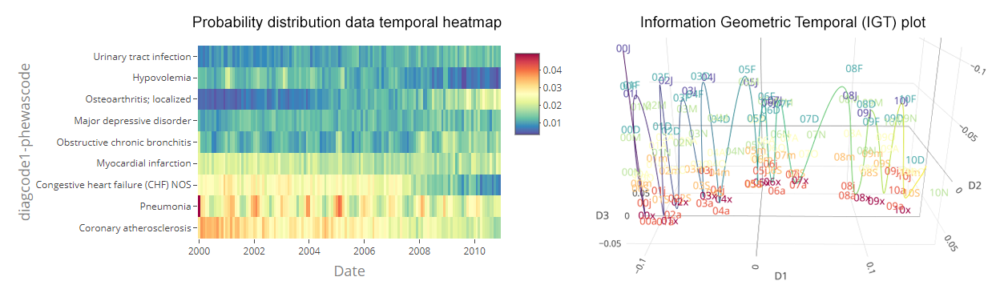

# EHRtemporalVariability [](https://cran.r-project.org/package=EHRtemporalVariability) [](https://cranlogs.r-pkg.org/badges/grand-total/EHRtemporalVariability)

R package for delineating temporal dataset shifts in Electronic Health Records

## What is this repository for?
Functions to delineate temporal dataset shifts in Electronic Health Records through the projection and visualization of dissimilarities among data temporal batches. This is done through the estimation of data statistical distributions over time and their projection in non-parametric statistical manifolds, uncovering the patterns of the data latent temporal variability. Dataset shifts can be explored and identified through visual analytics formats such as Data Temporal Heatmaps (DTHs) and Information Geometric Temporal (IGT) plots [1-3](https://github.com/hms-dbmi/EHRtemporalVariability#Citation). An additional [EHRtemporalVariability Shiny app](https://github.com/hms-dbmi/EHRtemporalVariability-shiny) can be used to load and explore the package results and even to allow the use of these functions to those users non-experienced in R coding.


*Sample DTH and IGT plot of variable 'Diagnosis Code #1 - PheWAS Code' of the [NHDS](https://www.cdc.gov/nchs/nhds/) data*

## Background
When making data science tasks on a longtime dataset, one must be aware that changes of reference and nature-induced changes in the data acquisition context can occur. These changes will likely be reflected as changes in the statistical distributions of data in form of dataset shifts. Temporal variability artifacts can introduce undesired heterogeneity in data over time, what can potentially hinder data quality and challenge the secondary use of data, particularly for population and data-driven research, as well as machine-learning. Statistical process control or time-series approaches can help detecting changes in summary statistics of data. However, there is a risk for loss of information, especially when deployed when using categorical variables with a particularly high number of values, as well as in multimodal statistical distributions in which multiple sub-phenotypes are present. EHRtemporalVariability provides the means to visually and analytically delineate dataset shifts in multi-modal and highly coded information, with no distributional assumptions made.

Our method is based upon the estimation and comparison of data statistical distributions over time [1-3](https://github.com/hms-dbmi/EHRtemporalVariability#Citation). DTHs allow users to explore changes in absolute and relative frequencies over time—and at multiple variable values simultaneously (e.g., frequencies of phenotypes). IGT plots project time batches as a series of points. The distances between them correspond to the dissimilarity of their statistical distributions. This yields an empirical layout of temporal relationships between batches, namely a non-parametric temporal statistical manifold. IGT plots allow users to visually identify four types of changes: trends, represented as continuously flowing time batches; abrupt changes, shown as gaps between groups of batches; temporal subgroups, depicted as clusters of batches; and seasonality, portrayed as temporal cycles. Additionally, batches are labeled by date and color-coded to distinguish seasonal effects. For more information on how to use EHRtemporalVariability to delinate and identify these changes, please see the [EHRtemporalVariability vignette](http://personales.upv.es/carsaesi/EHRtemporalVariability/EHRtemporalVariability.html)

## Package' Status

 * __Version__: 1.1.3
 * __Authors__: Carlos Sáez (UPV-HMS), Alba Gutiérrez-Sacristán (HMS), Isaac Kohane (HMS), Juan M García-Gómez (UPV), Paul Avillach (HMS)
 * __Maintainer__: Carlos Sáez (UPV-HMS)
 
 Copyright: 2019 - Biomedical Data Science Lab, Universitat Politècnica de València, Spain (UPV) - Department of Biomedical Informatics, Harvard Medical School (HMS)

## Documentation

* Vignette: [EHRtemporalVariability: Delineating temporal dataset shifts in electronic health records](http://personales.upv.es/carsaesi/EHRtemporalVariability/EHRtemporalVariability.html)

* [Package help](https://github.com/hms-dbmi/EHRtemporalVariability/raw/master/vignettes/EHRtemporalVariabilityHelp.pdf)

## Citation

If you use EHRtemporalVariability, please cite:

Sáez C, Gutiérrez-Sacristán A, Kohane I, García-Gómez JM, Avillach P. EHRtemporalVariability: delineating temporal data-set shifts in electronic health records. GigaScience, Volume 9, Issue 8, August 2020, giaa079. https://doi.org/10.1093/gigascience/giaa079

Consider also citing any of the original methods and case studies describing the approach:

[1]: Sáez C, Rodrigues PP, Gama J, Robles M, García-Gómez JM. Probabilistic change detection and visualization methods for the assessment of temporal stability in biomedical data quality. Data Mining and Knowledge Discovery. 2015;29:950–75. https://doi.org/10.1007/s10618-014-0378-6

[2]: Sáez C, Zurriaga O, Pérez-Panadés J, Melchor I, Robles M, García-Gómez JM. Applying probabilistic temporal and multisite data quality control methods to a public health mortality registry in spain: A systematic approach to quality control of repositories. Journal of the American Medical Informatics Association. 2016;23:1085–95. https://doi.org/10.1093/jamia/ocw010

[3]: Sáez C, García-Gómez JM. Kinematics of Big Biomedical Data to characterize temporal variability and seasonality of data repositories: Functional Data Analysis of data temporal evolution over non-parametric statistical manifolds. International Journal of Medical Informatics. 2018;119:109–24. https://doi.org/10.1016/j.ijmedinf.2018.09.015


## Download

Install the latest released version from CRAN

```R
install.packages("EHRtemporalVariability")
```

Download the latest development code of EHRtemporalVariability from GitHub using [devtools](https://cran.r-project.org/package=devtools) with

```R
devtools::install_github("hms-dbmi/EHRtemporalVariability")
```