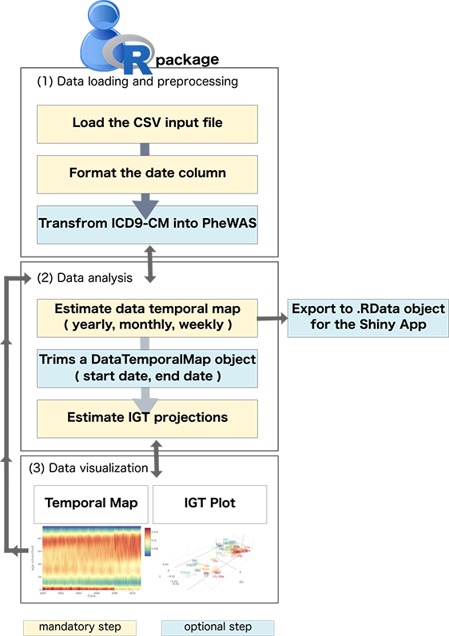

```{r setup, include=FALSE}
knitr::opts_chunk$set(echo = TRUE)
```

# Introduction
The `EHRtemporalVariability` package contains functions to delineate reference changes over time in Electronic Health Records through the projection and visualization of dissimilarities among data temporal batches. This is done through the estimation of data statistical distributions over time and their projection in non-parametric statistical manifolds uncovering the patterns of the data latent temporal variability. Results can be explored through visual analytics formats such as Data Temporal heatmaps and Information Geometric Temporal (IGT) plots [@saez_probabilistic_2015,@saez2016applying]. An additional [EHRtemporalVariability Shiny app](https://github.com/hms-dbmi/variability-shiny) can be used to load and explore the package results towards an improved investigation experience and even to allow the use of these functions to those users non-experienced in R coding.

## Background
Biomedical Data research repositories and property biomedical research databases are becoming bigger both in terms of sample size and collected variables [@Gewin2016,@Andreu-Perez2015]. Two significant reasons behind of this are the widespread adoption of data-sharing initiatives and technological infrastructures, and the continuous and systematic population of those repositories over longer periods of time. However, these two situations can also introduce potential confounding factors in data which may hinder their reuse for research, such as in population research or in statistical and machine learning modelling. Concretely, differences in protocols, populations, or even unexpected biases, either caused by systems or humans, can lead to changes of reference in data over time. This data temporal variability will be reflected on its statistical distributions, related to the above mentioned confounding factors which, in the end, represent a Data Quality (DQ) issue which must be addressed for a reliable data reuse [@saez2016applying,@schlegel2017secondary].

The `EHRtemporalVariability` package has been developed to help preventing this problem.

The tasks that can be performed with `EHRtemporalVariability` package are the following:

  1. Estimate the probability distributions of numerical and coded variables on temporal batches at a yearly, monthly or weekly period.
  2. Plot and explore `data temporal heatmaps` of absolute and relative frequencies of variable values over temporal batches.
  3. Estimate a projection of the variability among data temporal batches, as a non-parametric information geometry embedding of the probabilistic distances among the probability distributions of temporal batches at a number of dimensions specified by the user, allowing for plotting (see next point) or further data analysis methods (such as unsupervised learning of temporal batches).
  4. Plot and explore the projection above through an `Information Geometric Temporal plot`, which helps delineating reference changes in data over time, including abrupt and recurrent changes, conceptually-related time periods (periods with similar data distributions), but also smooth temporal trends.
  5. Additional data pre- and processing options, such as mapping International Classification of Diseases 9th revision (ICD-9) codes to phenotype codes used in Phenome-Wide Association studies (PheWAS), or trimming data temporal maps.

In the following sections the specific functions that can be used to address each of these tasks are presented.



For more information about the methods please check reference [@saez_probabilistic_2015] and the Suplemental Material in [@saez2016applying].

## Installation 
`EHRtemporalVariability` is provided through CRAN and GitHub. To install the CRAN version the user must type the following commands in an R session:

```{r cran, message=FALSE, eval=FALSE, warning=FALSE}
install.packages("EHRtemporalVariability")
library(EHRtemporalVariability)
```

```{r crantrue, echo=FALSE, message=FALSE, eval=TRUE, warning=FALSE}
library(EHRtemporalVariability)
```

The GitHub version of the package will, in general, provide the latest updates before these are commited to the CRAN version. In order to install it, `devtools` package - available in CRAN (https://cran.r-project.org/) - is required. To install `devtools` the user must type the following commands in an R session:

```{r devtls, message=FALSE, eval=FALSE, warning=FALSE}
install.packages("devtools")
library(devtools)
```

Once `devtools` package has been installed the user can install `EHRtemporalVariability` typing the following commands in an R session:

```{r bioC, message=FALSE, eval=FALSE, warning=FALSE}
install_github( "hms-dbmi/EHRtemporalVariability" )
library( EHRtemporalVariability )
```

## S4 objects 

### `DataTemporalMap`

The `DataTemporalMap` object contains the statistical distributions of data estimated at a specific time period. 

```{r EHRtemporalVariabilityObj1, echo = FALSE, eval = TRUE}
githubURL <- "http://github.com/hms-dbmi/EHRtemporalVariability-DataExamples/raw/master/variabilityDemoNHDS.RData"
load(url(githubURL))
```

```{r variabilityObj2, eval=TRUE}
class( probMaps$`diagcode1-phewascode` )
```
<br>
`DataTemporalMap` object is the output of `estimateDataTemporalMap` function. It is used as input for `plotDataTemporalMap` functions.

<br>
<span style="background-color:LemonChiffon">Note that objects of this class can be generated automatically by the `estimateDataTemporalMap` function, but its construction and extension is open towards fostering its use through external methods. E.g., one may ise additional probability distribution estimation methods, or even contruct compatible `DataTemporalMap` object for other unstructured data shuch as images or free text.</span>

### `IGTProjection`

The `IGTProjection` object contains the projected non-parametric statistical manifold of a `DataTemporalMap` object (also included in the object) estimated in a specific number of dimensions.

```{r igtProjObj, eval=TRUE}
class( igtProjs$`diagcode1-phewascode` )
```
<br>
`IGTProjection` object is the output of `estimateIGTProjection` function. It is used as input for `plotIGTProjection` functions.

<br>
<span style="background-color:LemonChiffon">Note that objects of this class are generated automatically by the `estimateIGTProjection` function.</span>

# Data pre-processing 

## Load the CSV input file 
The first step consists on read the CSV file that contains the data for the analysis. To do it, the user can apply the `read.csv` function.

The `read.csv` function reads a file in table format and creates a data frame from it, with cases corresponding to lines and variables to fields in the file. It is important to define the class of each column when reading the CSV file. 

An example of how to read the CSV file is shown next:

```{r readCSV, eval=TRUE}
dataset <- read.csv2( "http://github.com/hms-dbmi/EHRtemporalVariability-DataExamples/raw/master/nhdsSubset.csv", 
                      sep  = ",",
                      header = TRUE, 
                      na.strings = "", 
                      colClasses = c( "character", "numeric", "factor",
                                      "numeric" , rep( "factor", 22 ) ) )
head( dataset)
```


## Transform the date column in 'Date' R format
The second step will be transform the date column in 'Date' R format. The `EHRtemporalVariability` R package allows the user to do this transformation applying the `formatDate` function.

The `formatDate` function transform the column containing the dates from the given data.frame input, using the following arguments:

  - _input_: a data.frame object with at least one column of dates.
  - _dateColumn_: the name of the column containing the date.
  - _dateFormat_: the date format as standard in R Dates, by default '%y/%m/%d'.

The `formatDate` function output is the same data.frame with the date column transformed.

```{r formatDate2, eval=TRUE}
class( dataset$date )
datasetFormatted <- EHRtemporalVariability::formatDate(
              input         = dataset,
              dateColumn    = "date",
              dateFormat = "%y/%m"
             )
head( datasetFormatted )[1:5, 1:5]
class( datasetFormatted$date )
```

## Transform the ICD9-CM into PheWAS codes
Once the CSV file has been readed and the date column transformed, the third step is to transform the ICD9-CM to PheWAS codes if needed (https://phewascatalog.org/) [@denny2013systematic]. 

<span style="background-color:LemonChiffon">This step is not mandatory, is an option for those analysis in which ICD9-CM are analyzed and want to be reduced and transformed into PheWAS codes.</span>  

The `EHRtemporalVariability` R package allows the user to do the mapping in an automatic way applying the `icd9toPheWAS` function.

The `icd9toPheWAS` map to PheWAS codes using as input a column containing ICD9-CM codes. This function has as input the following arguments:

  - _data_: a data.frame object with at least one column of ICD9-CM codes that one to be transformed into a PheWAS code.
  - _icd9ColumnName_: the name of the column containing the ICD9-CM.
  - _missingValues_: the value used to determine missing values in the data.frame.
  - _phecodeDescription_: an optional argument to determine if instead to mapping to the PheWAS code, the user is interested in mapping to the PheWAS code description. 
  - _replaceColumn_: an optional argument to determine if you want to replace the ICD9-CM codes column or if you want to generate a new one for the PheWAS codes. 
  - _statistics_: if TRUE, shows the summary of the mapping like the percentage of initial ICD9-CM codes mapped to PheWAS code.
  - _replaceColumn_: whether to replace the original ICD9-CM column with the PheWAS codes or, if FALSE, create a new column with the PheWAS code.


The `icd9toPheWAS` function output is the ICD9-CM column transformed into PheWAS codes. In this specific "NHDS" example we will create a new column with the PheWAS codes that map to the diagcode2 column in the original data.frame. 

```{r icd9toPheWAS, eval=TRUE, message=FALSE, warning=FALSE}
datasetPheWAS <- icd9toPheWAS(data           = datasetFormatted,
                              icd9ColumnName = "diagcode1",
                              phecodeDescription = TRUE,
                              missingValues  = "N/A", 
                              statistics     = TRUE, 
                              replaceColumn  = FALSE)

head( datasetPheWAS[, c( "diagcode1", "diagcode1-phewascode")] )
```

# Data analysis

## Estimate data temporal map
The `estimateDataTemporalMap` function estimates a `DataTemporalMap` object from a data.frame containing individuals in rows and the variables in columns, being one of these columns the analysis date. This function has as input the following arguments:

  - _data_: a data.frame containing as many rows as individuals, and as many columns as the analysis variables plus the individual acqusition date.
  - _dateColumnName_: a string indicating the name of the column in data containing the analysis date variable.
  - _period_ : the period at which to batch data for the analysis from "week", "month" and "year", with "month" as default.

Additionally this function has the following optional arguments:

  - _startDate_: a Date object indicating the date at which to start the analysis. By default the first chronological date in the date column will be selected.
  - _endDate_: a Date object indicating the date at which to end the analysis. By default the last chronological date in the date column will be selected. 
  - _supports_: a List of objects containing the support of the data distributions for each variable, in classes `numeric`, `integer`, `character`, or `factor` (accordingly to the variable type), and where the name of the list element must correspond to the column name of its variable. If not provided it is automatically estimated from data.
  - _numericVariablesBins_: the number of bins at which to define the frequency histogram for numerical variables. By default is set to 100.
  - _numericSmoothing_: a logical value indicating whether a Kernel Density Estimation smoothing (Gaussian kernel, default bandwith) is to be applied on numerical variables (the default) or a traditional histogram instead.
  - _dateGapsSmoothing_: a logical value indicating whether a linear smoothing is applied to those time batches without data, by default gaps are filled with NAs.

The `estimateDataTemporalMap` function output is a `DataTemporalMap` object or a list of `DataTemporalMap` objects depending on the number of analysis variables.

```{r estimateDataTemporalMap, eval=FALSE}
probMaps <- estimateDataTemporalMap(data           = datasetPheWAS, 
                                    dateColumnName = "date", 
                                    period         = "month")
```

In the previous specific example, nhds data frame is used as input, with the `date` column previously formated to `Date` format. The `estimateDataTemporalMap` function has been applied to the X variables present in the initial data set. As a result, a list of X `DataTemporalMap` objects is obtained.

```{r estimateDataTemporalMapOutput, eval=TRUE}
class( probMaps )
class( probMaps[[ 1 ]] )
```

Variable supports can be set manually for all or some of the variables using the `support` parameter. The support of those variables not present in the `support` parameter will be estimated automatically as when the parameter is not passed.

```{r estimateDataTemporalMapSupport, eval=FALSE}
supports <- vector("list",2)
names(supports) <- c("age","diagcode1")
supports[[1]] <- 1:18
supports[[2]] <- c("V3000","042--","07999","1550-","2252-")
probMapsWithSupports <- estimateDataTemporalMap(data           = datasetPheWAS, 
                                    dateColumnName = "date", 
                                    period         = "month",
                                    supports       = supports)
```

## Trims a DataTemporalMap object
Additionally, the `EHRtemporalVariability` R package contains a function that allows the user to trim any `DataTemporalMap` object according to a start and end date. 

The `trimDataTemporalMap` function needs as input the following arguments:

  - _dataTemporalMap_: a `DataTemporalMap` object.
  - _startDate_: a date indicating the start date to trim from.
  - _endDate_: a date indicating the end date to trim from.


The `trimDataTemporalMap` function output is a new `DataTemporalMap` object.

```{r trimDataTemporalMap, eval=TRUE}
class( probMaps[[1]] )
probMapTrimmed <- trimDataTemporalMap( 
                        dataTemporalMap = probMaps[[1]],
                        startDate       = "2005-01-01",
                        endDate         = "2008-12-01"
                                      )
class( probMapTrimmed )
```


## Estimate IGT projections
The `estimateIGTProjection` function estimates a `IGTProjection` object from a `DataTemporalMap` object. This function has as input the following arguments:

  - _dataTemporalMap_: a `DataTemporalMap` object.
  - _dimensions_: integer value indicating the number of dimensions for the projection.
  - _startDate_: a Date object indicating the date at which to start the analysis, in case of being different from the first chronological date in the date column (the default).
  - _endDate_: a Date object indicating the date at which to end the analysis, in case of being different from the last chronological date in the date column (the default).


The `estimateIGTProjection` function output is a `IGTProjection` object.

```{r estimateIGTProjection, eval=FALSE}
igtProj <- estimateIGTProjection( dataTemporalMap = probMaps[[1]], 
                                  dimensions      = 3, 
                                  startDate       = "2000-01-01", 
                                  endDate         = "2010-12-31")
```

In the previous specific example, the `estimateIGTProjection` function has been applied to the X variables present in the previous `DataTemporalMap` object. As a result, a list of X `IGTProjection` objects is obtained.

```{r estimateIGTProjectionOutput, eval=FALSE}
class( igtProj )
```

The `sapply` function can be used if the `estimateIGTProjection` function needs to be applied to the output from `estimateDataTemporalMap` function including more than one variables, which result is a list of `DataTemporalMap` objects, as follows:

```{r sapplyestimateIGTProjection, eval=FALSE}
igtProjs <- sapply ( probMaps, estimateIGTProjection )
names( igtProjs ) <- names( probMaps )
class( igtProj[[ 1 ]] )
```

# Data visualization
`EHRtemporalVariability` offers two different options to visualize the results, heatmaps and Information Geometric Temporal (IGT) plots. An special focus is made on visualization colors. 

<span style="background-color:LemonChiffon">The default "Spectral" palette shows a color temperature scheme from blue, through yellow, to red. The four remaining options are better suited for those with colorblindness, including "Viridis", "Magma", and their reversed versions "Viridis-reversed" and "Magma-reversed".</span>

## Plot data temporal maps
The `plotDataTemporalMap` function returns a heatmap plot.  This function has as input the following arguments:

  - _dataTemporalMap_: the `DataTemporalMap` object.
  - _absolute_: inidicates if the heatmap frequency values are absolute or relative. By default FALSE.  
  - _startValue_: indicates the first value to display in the heatmap. By default 1. 
  - _endValue_: indicates the last value to display in the heatmap. By default the last value of the DataTemporalMap object.  
  - _startDate_: a Date object indicating the first date to be displayed in the heatmap. By default the first date of the DataTemporalMap object. 
  - _endDate_: a Date object indicating the last date to be displayed in the heatmap. By default the last date of the DataTemporalMap object.
  - _sortingMethod_: the method to sort data in the Y axis of the heatmap from "frequency" and "alphabetical", with "frequency" as default.
  - _colorPalette_: the color palette to be used. 

To illustrate the next examples we load the example .Rdata file, which contains the results from analyzing the complete "NHDS" dataset.

```{r loadExampleFile, eval=TRUE}
githubURL <- "https://github.com/hms-dbmi/EHRtemporalVariability-DataExamples/raw/master/variabilityDemoNHDS.RData"
load(url(githubURL))
```

```{r plotHeatmap, eval=TRUE}
plotDataTemporalMap(
    dataTemporalMap =  probMaps[["diagcode1-phewascode"]],
    startValue = 2,
    endValue = 20,
    colorPalette    = "Spectral")
```

## Plot IGT projections
The `plotIGTProjection` function returns an interactive Information Geometric Temporal (IGT) plot from an `IGTProjection` object. This function has as input the following arguments:

  - _igtProjection_: the `IGTProjection` object.
  - _dimensions_: the number of dimensions of the plot (2 or 3).
   - _startDate_: a Date object indicating the first date to be displayed in the IGT plot. By default the first date of the IGTProjection object. 
  - _endDate_: a Date object indicating the last date to be displayed in the IGT plot By default the last date of the IGTProjection object.
  - _colorPalette_: the color palette to be used. 

```{r plotIGTprojection, eval=TRUE}
plotIGTProjection( 
    igtProjection   =  igtProjs[["diagcode1-phewascode"]],
    colorPalette    = "Spectral", 
    dimensions      = 2)
```

An IGT plot visualizes the variability among time batches in a data repository in a 2D or 3D plot. Time batches are positioned as points where the distance between them represents the probabilistic distance between their distributions (currently Jensen-Shannon distance, more distances will be supported in the future). 

<br>
To track the temporal evolution, temporal batches are labeled to show their date and colored according to their season or period, according to the analysis period, as follows. If period=="year" the label is "yy" (2 digit year) and the color is according to year. If period=="month" the label is "yym" (yy + abbreviatted month) and the color is according to the season (yearly). If period=="week" the label is "yymmw" (yym + ISO week number in 1-2 digit) and the color is according to the season (yearly). 


| Month | Abbreviaton | 
| ------|-------------|
| January | J         |
| February | F         |
| March | M         |
| April | a         |
| May | m         |
| June | j         |
| July | x         |
| August | a         |
| September | S         |
| October | O         |
| November | N         |
| December | D         |

## Exporting data for the Shiny app dashboard

The [EHRtemporalVariability Shiny app](https://github.com/hms-dbmi/variability-shiny) allows loading your own .csv file through simple configuration steps but, however, with limited data pre-processing. Consequently, users can export the DataTemporalHeatmaps and IGTplots generated from the R package as an .RData file for their exporation through the interactive Shiny app dashboard. The export is done as follows (note that both DataTemporalHeatmaps and IGTplots must be lists of same size where the names of their items correspond to the variable names):

```{r saveRData, eval=FALSE}
names( probMaps )
names( igtProjs )
save(probMaps, igtProjs, file = "myExport.RData")
```

# Summary of `EHRtemporalVariability` functions available

| Input Object    | `EHRtemporalVariability` function | Output Generated                                |
| ----------------|-----------------------|---------------------------------------------------|
| data.frame       | `formatDate`             | Given a data.frame object with a column of dates in 'character' format, it generates a new data.frame object with the dates transformed into "Date" R format.|
| data.frame       | `icd9toPheWAS`        | Given a data.frame object with a column of ICD9-CM codes, it generates a new data.frame object with the ICD9-CM codes transformed into PheWAS codes |
| data.frame       | `estimateDataTemporalMap` | Given a data.frame object containing individuals in rows and the variables in columns, it generates a `DataTemporalMap` object or a list of DataTemporalMap objects depending on the number of analysis variables |
| `DataTemporalMap`| `trimDataTemporalMap` | Given a  `DataTemporalMap` object, it generates a trim `DataTemporalMap` object |
| `DataTemporalMap`| `estimateIGTProjection` | Given a  `estimateDataTemporalMap` object, it generates a `IGTProjection` object or a list of `IGTProjection` objects depending on the number of analysis variables |
| `DataTemporalMap`| `plotDataTemporalMap` | Given a  `DataTemporalMap` object, it generates an interactive heatmap |
| `IGTProjection`| `plotIGTProjection` | Given a  `IGTProjection` object, it generates an interactive Information Geometric Temporal (IGT) plot |

: (\#tab:viz-opt) Functions in `EHRtemporalVariability` R package


# Bibliography
